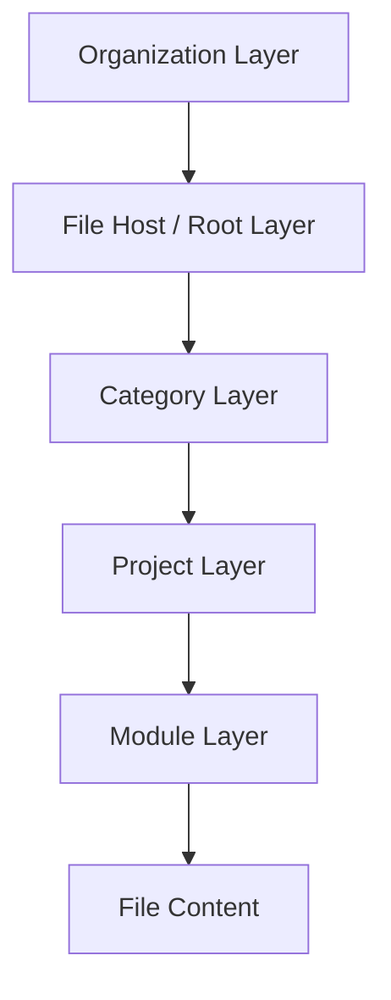
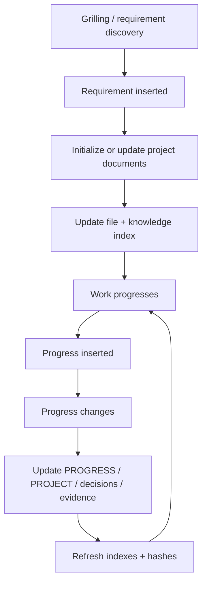
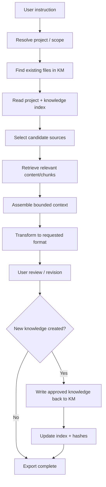
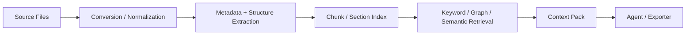
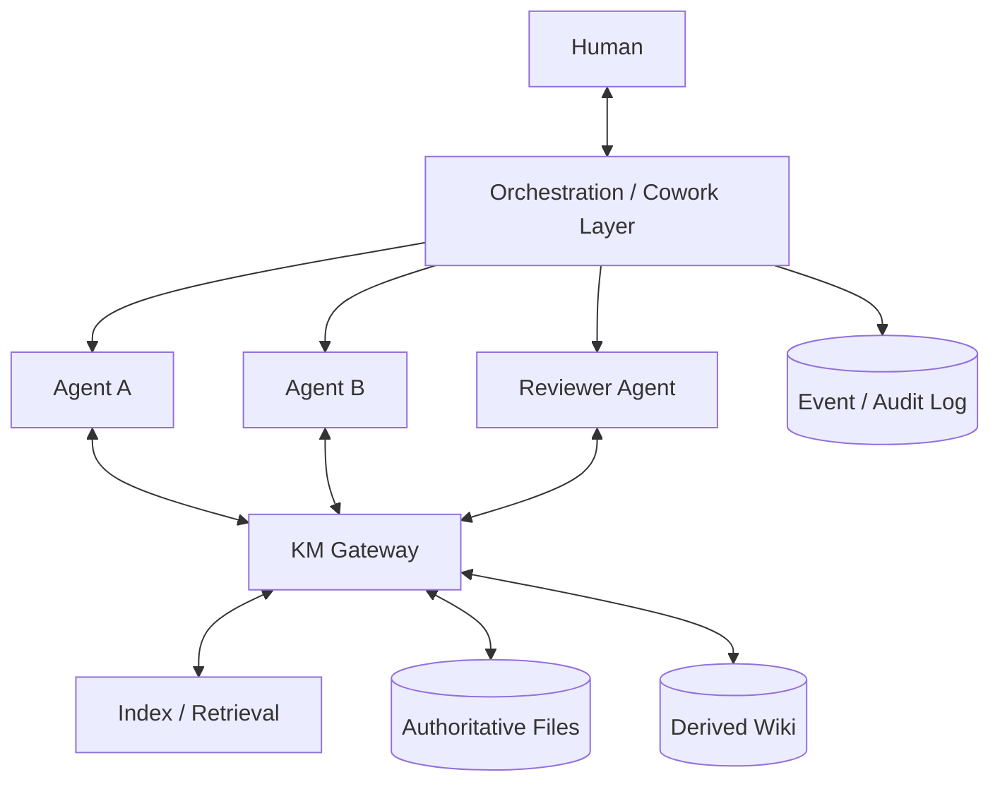
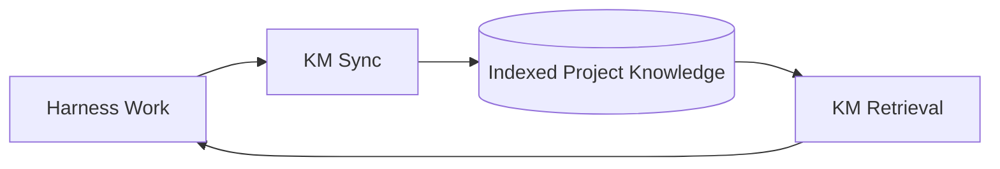

# Knowledge Management (KM) — System Requirements & Workflow

**Document type:** System proposal / presentation source  
**Status:** Draft proposal  
**Version:** 0.1  
**Prepared:** 2026-08-30  
**Primary audience:** Product leadership, engineering leadership, platform/AI engineering, knowledge-management owners  
**Companion document:** `Harness-requirement.md`

---

## 1. Executive Summary

The **KM System** is the durable knowledge substrate for the Software Development Harness and other organizational workflows. Its purpose is to convert project conversations, requirements, decisions, files, code documentation, progress, and evidence into an indexed, retrievable, reviewable body of knowledge.

The KM design has two main operational loops:

### KM Sync Loop

```text
Grilling
→ Requirement inserted
→ Project document initiate/update + file index update
→ Progress inserted
→ Progress updated
→ Project document updated + file index updated
```

### KM Export Loop

```text
Instruction
→ Find existing knowledge/file in KM
→ Retrieve knowledge index
→ Retrieve relevant content chunks from index
→ Assemble context
→ Convert to expected format
→ User review/revision
→ Update knowledge into KM
→ Update index in KM
```

The system uses a layered file hierarchy, explicit metadata, index files, source attribution, content hashes/revisions, and a review-before-authority rule. AI-generated summaries or wiki pages are **derived knowledge**, not automatically the same thing as an authoritative source file.

---

## 2. KM Objectives

The KM system must:

- preserve durable project knowledge across AI agents, tools, sessions, and teams;
- give an agent the minimum relevant context without loading an entire repository;
- maintain source-of-truth relationships between original files and derived summaries/wiki pages;
- support human-readable Markdown as the primary knowledge format;
- index files, projects, modules, concepts, entities, requirements, decisions, progress, and evidence;
- support file ingestion from PDFs, Office documents, Markdown, code repositories, and exported artifacts;
- support both project-local knowledge and organization-wide discovery;
- enable reliable export into presentations, reports, PRDs, prompts, briefs, tickets, and other formats;
- synchronize naturally with the Harness lifecycle;
- remain tool-portable and avoid depending on a single vector database, LLM provider, or agent runtime.

---

## 3. Functional Requirements

| ID | Requirement | Priority |
| --- | --- | --- |
| KM-FR-001 | KM shall implement the Organization → File Host → Category → Project → Module → File Content hierarchy. | Must |
| KM-FR-002 | KM shall distinguish authoritative sources, operational records, derived knowledge, indexes/metadata, and ephemeral context. | Must |
| KM-FR-003 | KM shall maintain a project-level current summary and file/knowledge index. | Must |
| KM-FR-004 | KM shall support stable file/content IDs, revisions/hashes, authority class, project/module ownership, and source relationships. | Must |
| KM-FR-005 | KM shall implement the Sync Loop from requirement/decision/progress events to authoritative documents and refreshed indexes. | Must |
| KM-FR-006 | KM shall implement the Export Loop from instruction to indexed retrieval, bounded context assembly, format conversion, review, and optional write-back. | Must |
| KM-FR-007 | KM shall preserve `CONTEXT.md` as domain vocabulary rather than using it as a PRD or implementation log. | Must |
| KM-FR-008 | KM shall support ADR storage for hard-to-reverse decisions and lightweight records for reversible decisions. | Must |
| KM-FR-009 | KM shall support structured conversion of heterogeneous source files into Markdown or equivalent normalized text. | Must |
| KM-FR-010 | KM shall preserve source attribution and revision metadata on derived chunks, summaries, concepts, entities, and wiki pages. | Must |
| KM-FR-011 | KM shall support structure-aware content chunking and bounded context retrieval. | Must |
| KM-FR-012 | KM shall use layered retrieval: deterministic index/metadata/exact search before more expensive graph/semantic synthesis where possible. | Must |
| KM-FR-013 | KM shall detect and mark stale derived knowledge when a source revision changes. | Must |
| KM-FR-014 | KM shall detect broken links, duplicate IDs, orphans, stale hashes, missing attribution, and unresolved contradictions. | Must |
| KM-FR-015 | KM shall prevent a derived summary/wiki page from silently overriding a current authoritative source. | Must |
| KM-FR-016 | KM shall support controlled writes with revision checks to prevent stale multi-agent updates. | Must |
| KM-FR-017 | KM shall provide a common Gateway/API/tool surface that multiple agent runtimes can use for retrieval and proposed updates. | Must |
| KM-FR-018 | KM shall synchronize meaningful Harness gates, requirements, decisions, progress, risk, walkthrough, and evidence records. | Must |
| KM-FR-019 | KM shall support project-local retrieval and organization-level discovery without forcing all project files into one physical repository. | Must |
| KM-FR-020 | KM shall propagate access/sensitivity rules from sources to indexes and derived content. | Must |
| KM-FR-021 | KM shall treat ingested content as untrusted data rather than executable agent instruction. | Must |
| KM-FR-022 | KM should support Obsidian/Git-compatible Markdown and `[[wikilink]]` knowledge graphs. | Should |
| KM-FR-023 | KM should support code-repository documentation/map adapters such as CodeSight and CodeWiki without making them authoritative. | Should |
| KM-FR-024 | KM should expose quality, freshness, retrieval, and resume-success metrics. | Should |

---

## 4. KM Layer Pyramid

The user-defined pyramid becomes the canonical information architecture:

```text
Organization Layer        (platform / governance / global index)
        ↓
File Host Layer           (root directory / repository / storage root)
        ↓
Categorize Layer          (categorical directories / domain collections)
        ↓
Project Layer             (project folder)
        ↓
Module Layer              (project subfolder / bounded context)
        ↓
File Content              (source and derived content)
```



### 4.1 Organization Layer

Owns:

- organization taxonomy;
- organization-wide project registry;
- global policies and vocabulary;
- cross-project knowledge index;
- access-control policy;
- retention and archival rules;
- shared templates and skills.

### 4.2 File Host Layer

Represents a physical/logical knowledge root such as:

- Git repository;
- local filesystem root;
- GitHub-backed Obsidian vault;
- object-store-backed knowledge workspace;
- mirrored document repository.

The File Host is storage; it is not automatically authority.

### 4.3 Category Layer

Groups knowledge into stable organizational categories, for example:

```text
/products/
/platform/
/research/
/operations/
/clients/
/architecture/
/policies/
```

Categories should describe durable ownership/domain boundaries, not temporary task states.

### 4.4 Project Layer

One project folder contains its canonical project knowledge and project-local index.

### 4.5 Module Layer

Subdivides large projects into bounded contexts/modules. Each module may have a local glossary/index and ADRs while still rolling up to the project index.

### 4.6 File Content Layer

Contains authoritative source files and derived knowledge artifacts with explicit relationships.

---

## 5. Knowledge Authority Model

KM must distinguish these classes:

| Class | Meaning | Example |
| --- | --- | --- |
| **Authoritative Source** | Human/approved artifact that defines current truth. | approved PRD, signed policy, current architecture ADR |
| **Operational Record** | Current workflow state or evidence. | progress update, test evidence, release record |
| **Derived Knowledge** | AI/human synthesized representation of sources. | summary, concept page, wiki page |
| **Index/Metadata** | Locator and retrieval structure. | project `INDEX.md`, global registry |
| **Ephemeral Context** | Temporary retrieval package/prompt context. | assembled chunks for one agent task |

### Rule

**Derived knowledge may accelerate retrieval but must never silently overwrite authoritative source truth.**

When derived content conflicts with an authoritative source, the conflict must be visible and source review must decide the outcome.

---

## 6. Canonical Project Structure

Recommended structure:

```text
<project>/
├── PROJECT.md                 # Project-level current summary
├── INDEX.md                   # Human + machine-readable file/knowledge index
├── CONTEXT.md                 # Canonical domain vocabulary
├── REQUIREMENTS.md            # Optional flattened requirement view
├── PROGRESS.md                # Current progress / milestones / blockers
├── DECISIONS.md               # Lightweight reversible decisions / links to ADRs
├── docs/
│   ├── instructions/
│   │   ├── OUTCOME.md
│   │   ├── PRD.md
│   │   ├── TEST.md
│   │   └── WALKTHROUGH.md
│   ├── adr/
│   ├── architecture/
│   ├── evidence/
│   ├── research/
│   └── exports/
├── modules/
│   └── <module>/
│       ├── INDEX.md
│       ├── CONTEXT.md
│       └── ...
├── source/                    # imported originals when appropriate
├── wiki/                      # generated concept/entity/summary pages
└── .km/
    ├── manifest.yaml
    ├── hashes.json
    ├── retrieval-index.*
    └── sync-state.json
```

This is a logical model. Existing repositories may retain established layouts if an index maps them cleanly.

---

## 7. Project Document Model

`PROJECT.md` is the current project-level narrative used for fast orientation. It should not duplicate every source file.

Recommended sections:

```markdown
# Project

## Purpose
## Current Status
## Current Outcome
## Current Scope
## Architecture Summary
## Active Work
## Recent Decisions
## Current Risks / Blockers
## Verification Status
## Key Files
## Next Gate
```

### Update rule

`PROJECT.md` is updated after meaningful state changes, not every agent token or minor edit.

---

## 8. File Index Model

`INDEX.md` is both a navigational document and a machine-readable retrieval aid.

Recommended entry shape:

```yaml
- id: FILE-023
  path: docs/instructions/PRD.md
  type: requirement-contract
  authority: authoritative
  project: harness
  module: lifecycle
  title: Production PRD
  summary: Defines minimum production requirements and Core/Minor boundaries.
  source_revision: sha256:...
  updated_at: 2026-08-30T10:00:00Z
  tags: [requirements, production, harness]
  links: [OUT-001, CORE-002, TEST-004]
  supersedes: null
```

The human-facing Markdown can render the same data as a compact table.

### 8.1 Index requirements

- stable file IDs even if files are renamed where possible;
- content hash/revision;
- authority class;
- source/derived relationship;
- project/module ownership;
- tags/type;
- concise description;
- links to requirement/decision/test IDs;
- update timestamp;
- stale/superseded status;
- sensitivity/access label where required.

---

## 9. KM Sync Loop

### 9.1 Canonical flow



### 9.2 Sync trigger classes

### Required immediate sync

- approved outcome/requirement change;
- architecture ADR;
- Scale-up vs MVP decision;
- security or compliance decision;
- production release;
- blocker that changes delivery plan;
- accepted residual risk;
- superseded authoritative file.

### Batched sync allowed

- routine progress updates;
- minor implementation decisions;
- non-authoritative research notes;
- generated wiki/concept pages;
- repeated evidence artifacts.

### 9.3 Sync transaction

```text
1. Detect changed knowledge event
2. Identify authoritative destination
3. Write/update source artifact
4. Validate links/IDs/metadata
5. Update PROJECT.md if project state changed
6. Update PROGRESS.md if execution state changed
7. Update INDEX.md / machine index
8. Recompute hashes / stale relationships
9. Run KM lint/health checks
10. Commit/publish transaction
```

The source artifact must be written **before** the index claims it exists.

---

## 10. Grilling → KM Requirement Insertion

Because this proposal has existing documents, the preferred discovery method is `grill-with-docs` rather than a plain interview.

### 10.1 What goes where

| Discovery output | KM destination |
| --- | --- |
| Canonical domain term | `CONTEXT.md` |
| Hard-to-reverse architectural decision | `docs/adr/ADR-*.md` |
| Product/system requirement | `OUTCOME.md` / `PRD.md` / requirement file |
| Temporary hypothesis | research/working note, not glossary |
| Progress statement | `PROGRESS.md` |
| Reversible implementation choice | decision log / walkthrough |
| Verification observation | evidence record |

### Important constraint

`CONTEXT.md` must remain a glossary/domain-language artifact. It must not become a hidden PRD, implementation plan, or dumping ground for every answer.

---

## 11. KM Export Loop

### 11.1 Canonical flow



### 11.2 Export targets

- presentation source;
- PowerPoint/slide outline;
- PRD/specification;
- status report;
- executive brief;
- architecture review;
- project proposal;
- agent prompt/instruction bundle;
- issue/ticket set;
- onboarding package;
- audit/evidence report;
- wiki/article.

### 11.3 Retrieval rule

Retrieve the **smallest sufficient set of authoritative context** first. Use derived wiki pages to discover sources, then retrieve authoritative source sections when the output depends on exact requirements or decisions.

---

## 12. Retrieval & Chunking Architecture



### 12.1 Chunking requirements

- prefer document structure: heading/section/table/code unit before arbitrary token windows;
- preserve source file ID and revision on every chunk;
- preserve heading path/page number/line range where available;
- avoid mixing authority levels in one chunk;
- maintain adjacency pointers for expansion;
- keep tables/code blocks intact where practical;
- mark generated/synthesized chunks as derived;
- store embedding/vector index as an optimization, not the source of truth.

### 12.2 Retrieval hierarchy

Recommended order:

```text
1. Project/Module INDEX
2. Exact ID/path/title match
3. Metadata/tag filtering
4. Keyword/BM25 search
5. Wiki-link / graph expansion
6. Semantic/vector retrieval
7. Full cross-document synthesis only when needed
```

This avoids paying for expensive full RAG when the answer is already available through deterministic indexes.

---

## 13. File Conversion Stack

The conversion layer should use interchangeable adapters.

### 13.1 MarkItDown

Microsoft MarkItDown is suitable as a local normalization utility for converting formats such as PDF and Office files to Markdown for indexing/text analysis.

**KM role:** `raw file → normalized Markdown`.

Security requirement: run conversion with least privilege and treat untrusted input as data.

### 13.2 OpenKB

OpenKB can compile documents into a Markdown wiki with summaries, concepts, entities, source representations, index pages, and saved explorations. It also supports long-document/PageIndex paths and outputs that work naturally with Obsidian.

**KM role:** `normalized corpus → derived wiki/knowledge graph + retrieval layer`.

### 13.3 Obsidian LLM Wiki

The Obsidian LLM Wiki plugin demonstrates a local-first pattern where source notes/files become generated `wiki/sources`, `wiki/entities`, and `wiki/concepts` pages with `[[wikilinks]]`, index regeneration, linting, and contradiction handling.

**KM role:** optional local user-facing knowledge workspace and graph maintenance layer.

### Requirement

Do not mandate all three. The conversion and derivation pipeline must be adapter-based.

---

## 14. Code & Repository Knowledge

### 14.1 CodeWiki

CodeWiki demonstrates repository-level, architecture-aware documentation with hierarchical decomposition and cross-module/system interactions.

**KM role:** deep generated architecture/code documentation for large codebases.

### 14.2 CodeSight

CodeSight provides a fast repository/knowledge map, wiki generation, blast-radius analysis, agent context files, and knowledge mode for Markdown/Obsidian material.

**KM role:** lightweight continuously refreshed repo map and change-impact context.

### 14.3 Recommended split

```text
CodeSight → fast map / context / change impact
CodeWiki  → deep architecture documentation when required
```

Generated code documentation remains derived knowledge. Code and approved architecture contracts remain authoritative.

---

## 15. Obsidian + Git Publication Layer

Obsidian is recommended as an optional human knowledge interface because Markdown and `[[wikilinks]]` align with the proposed KM model.

`Obsidian-Gitsync-Perlite` demonstrates a pattern for continuously syncing an Obsidian Markdown repository from Git and publishing a read-only web view.

## Requirements

- Git is a version/history transport, not the retrieval engine itself;
- generated wiki output should be isolated from hand-authored sources where practical;
- publication should preserve read-only boundaries for external viewers;
- private repositories require controlled credentials and least-privilege access;
- generated knowledge can be rebuilt from authoritative sources when feasible.

---

## 16. Agent Integration Architecture

The KM system should support agents working through different orchestration layers.



### 16.1 Reference platforms

### Munder Difflin

Useful concepts:

- wrap multiple terminal coding CLIs;
- per-agent memory;
- inbox/outbox mailbox routing;
- shared blackboard;
- event log;
- orchestrator;
- single-writer-per-file discipline.

**KM implication:** use explicit write ownership and route cross-agent updates through a KM transaction/controller instead of letting every agent edit every index concurrently.

### Multica

Useful concepts:

- assign issues to many agent CLIs like teammates;
- agent reports progress/blockers and returns work for review;
- local execution daemon near the code;
- kanban/workspace control plane.

**KM implication:** task state can trigger sync events and provide clear ownership/progress metadata.

### AionUi

Useful concepts:

- unified Cowork UI;
- external CLI agents via ACP;
- team leader/teammate execution;
- shared task board and workspace;
- per-agent permission prompts.

**KM implication:** the KM Gateway can be exposed as a common agent tool regardless of backend CLI.

### Buzz

Useful concepts:

- humans and agents share workspace rooms/threads;
- signed events and identity;
- workflows, approvals, git events, and conversation in one event model;
- searchable/auditable thread history;
- ACP/agent-first CLI support.

**KM implication:** event threads can be an operational/audit record while durable accepted knowledge is promoted into authoritative KM files.

---

## 17. KM Gateway Interface

Agents should access KM through a narrow interface rather than ad-hoc filesystem search when possible.

Recommended operations:

```text
resolve_scope(project?, module?)
get_project_summary()
search_index(query, filters)
get_file(file_id, revision?)
get_chunk(chunk_id)
expand_context(file_id, heading?)
get_requirement(id)
get_decision(id)
get_evidence(id)
propose_update(target, patch, rationale)
record_progress(event)
record_decision(event)
refresh_index(scope)
lint(scope)
export_context_pack(task)
```

### Write-control rule

Agents may propose changes, but authoritative writes should go through validation that checks:

- write authority;
- expected file revision;
- stable IDs;
- broken links;
- metadata/schema;
- conflict with current contracts/ADRs;
- index update requirement.

---

## 18. Concurrency & Multi-Agent Safety

Multi-agent KM fails if several agents edit shared files without coordination.

Recommended model:

1. **Single writer per authoritative file or transaction.**
2. Agents write proposed changes to task-local/output areas.
3. KM controller merges approved updates.
4. Use optimistic concurrency with source revision/hash.
5. Reject stale writes and force rebase/retrieval.
6. Index regeneration runs after authoritative file commit.
7. Append-only event logs are preferred for raw progress/history.

This borrows the useful single-writer/mailbox separation seen in Munder Difflin while keeping KM storage independent from that product.

---

## 19. Progress Model

`PROGRESS.md` should answer current execution questions without requiring issue-board access.

Recommended record:

```yaml
- id: PROG-042
  work_item: PLAN-008
  status: in_progress
  owner: agent-or-human-id
  started_at: ...
  updated_at: ...
  completed: [PRD-004]
  active: [CORE-002]
  blockers: [RISK-003]
  evidence: [EVD-011]
  next_gate: core-review
```

### Rule

Progress is operational truth, not product authority. A progress update cannot change an approved requirement.

---

## 20. Knowledge Quality Controls

### 20.1 KM lint

Minimum checks:

- broken links;
- missing source files;
- duplicate IDs;
- duplicate concept/entity pages;
- stale hashes;
- orphan project/module files;
- superseded source presented as current;
- derived page with missing source attribution;
- unresolved contradiction;
- index entry pointing to missing content;
- authoritative file omitted from project index.

### 20.2 Contradictions

If two sources disagree:

```text
1. Identify authority class and revisions
2. Mark contradiction
3. Prefer latest approved authoritative source for execution
4. Preserve conflicting evidence/history
5. Require decision if authority is equal/unclear
6. Update derived pages after resolution
```

### 20.3 Hallucination boundary

LLM-generated summaries, concepts, and wiki pages must identify their source files. For sensitive decisions, export should retrieve the underlying authoritative source rather than rely solely on the summary.

---

## 21. Security, Privacy & Governance

## Required controls

- classify sensitive files and restrict retrieval scope;
- never place secrets, tokens, credentials, or private keys into generated wiki pages;
- propagate access labels from source to derived content;
- keep audit logs for authoritative writes;
- support retention/deletion policies;
- treat ingested documents as untrusted data, not agent instructions;
- isolate conversion/parsing of untrusted files where possible;
- use least-privilege repository and object-store credentials;
- distinguish local-only projects from cloud-indexable projects;
- record which LLM/provider processed sensitive content where policy requires it.

---

## 22. Harness ↔ KM Integration

The Harness and KM form a closed delivery-memory loop.



## Before each Harness loop

KM provides:

- current project state;
- approved requirements;
- relevant glossary;
- ADRs;
- current code/wiki map;
- active risks/blockers;
- previous verification evidence.

## During a Harness loop

KM receives:

- progress events;
- provisional research/notes;
- decisions awaiting promotion.

## At Harness gates

KM receives authoritative updates:

- approved contracts;
- Scale-up/MVP decision;
- architecture ADRs;
- Core approval;
- walkthrough;
- verification evidence;
- release/update summary.

---

## 23. KM System State Model

| State | Meaning |
| --- | --- |
| `UNREGISTERED` | Project/file exists but is not yet indexed. |
| `INDEXING` | Metadata/content extraction in progress. |
| `CURRENT` | Index matches current authoritative revisions. |
| `DIRTY` | One or more source files changed; index refresh required. |
| `CONFLICT` | Contradictory authority or concurrent write requires resolution. |
| `STALE_DERIVATION` | Derived wiki/summary no longer matches source revision. |
| `REVIEW_REQUIRED` | Proposed authoritative knowledge update awaits approval. |
| `ARCHIVED` | Retained but excluded from normal current retrieval. |
| `ERROR` | Conversion/indexing failed and requires intervention. |

---

## 24. Event Model

A minimal event log improves auditability and sync automation.

```yaml
id: EVT-000123
type: requirement.approved
project: harness
module: lifecycle
actor: user-or-agent-id
source_ids: [PRD-004]
source_revision: sha256:...
timestamp: 2026-08-30T10:00:00Z
summary: Approved production-path decision requirement.
actions:
  - update_project_summary
  - refresh_index
  - mark_dependent_docs_stale
```

Suggested event types:

- `requirement.created`
- `requirement.approved`
- `requirement.revised`
- `decision.recorded`
- `adr.approved`
- `progress.updated`
- `risk.created`
- `risk.closed`
- `evidence.recorded`
- `release.completed`
- `file.changed`
- `index.refreshed`
- `derivation.stale`
- `export.completed`

---

## 25. Recommended Implementation Phases

## Phase 1 — Markdown KM Foundation

Build:

- organization/project/module hierarchy;
- `PROJECT.md`, `INDEX.md`, `PROGRESS.md`, `CONTEXT.md` conventions;
- stable IDs and metadata;
- Git-backed authoritative storage;
- manual/CLI sync and lint;
- Harness integration at key gates.

**Goal:** reliable source of truth without vector infrastructure.

## Phase 2 — Conversion & Derived Wiki

Add:

- MarkItDown adapter;
- OpenKB or equivalent compilation adapter;
- generated wiki separation;
- source attribution and stale detection;
- Obsidian access.

**Goal:** ingest heterogeneous documents and make them navigable.

## Phase 3 — Retrieval Gateway

Add:

- deterministic index search;
- keyword search;
- graph/wikilink expansion;
- optional semantic/vector retrieval;
- context-pack generation;
- agent KM tool/API.

**Goal:** bounded context retrieval for agents.

## Phase 4 — Agent/Board Integration

Add adapters for one or more of:

- Multica;
- AionUi;
- Munder Difflin;
- Buzz;
- custom CLI orchestrator.

**Goal:** progress/events and KM sync become part of agent execution.

## Phase 5 — Automated Documentation Intelligence

Add selectively:

- CodeSight repo maps;
- CodeWiki deep documentation;
- contradiction detection;
- stale-document remediation proposals;
- automated export pipelines.

**Goal:** maintain current knowledge with bounded human review.

---

## 26. Metrics

| Metric | Meaning |
| --- | --- |
| Index freshness | % current files whose indexed revision matches source |
| Retrieval precision | % retrieved chunks judged useful/relevant |
| Authoritative-source hit rate | % important exports grounded in authoritative files |
| Stale derivation count | Generated pages needing refresh |
| Orphan file count | Project knowledge not represented in index |
| Broken link rate | Health of graph/navigation |
| Knowledge promotion latency | Time from approved decision to KM availability |
| Agent context size | Context tokens required per task |
| Resume success rate | New agent can continue without user restating prior decisions |
| Contradiction resolution time | Time to resolve conflicting knowledge |
| Export rework rate | User revisions caused by missing/wrong context |

---

## 27. Initial ADR Set for Proposal

### ADR-K001 — Markdown-first authoritative knowledge

**Decision:** Human/agent-readable Markdown plus small machine metadata is the default authority layer.

**Why:** Portable, Git-friendly, reviewable, easy for many agents/CLIs to consume.

### ADR-K002 — Indexes are derived locators, not source authority

**Decision:** A stale index cannot override the source file revision.

### ADR-K003 — Derived wiki is separated from original source

**Decision:** Generated summaries/concepts/entities must keep source attribution and can be regenerated.

### ADR-K004 — Retrieval is layered, not vector-only

**Decision:** Deterministic metadata/index/keyword/graph retrieval precedes semantic retrieval when sufficient.

### ADR-K005 — Single-writer transaction for authoritative updates

**Decision:** Multi-agent systems submit changes through controlled writes to prevent index/file corruption and silent lost updates.

### ADR-K006 — KM sync is triggered by meaningful state changes

**Decision:** Not every low-level action becomes knowledge; approvals, decisions, milestones, risks, and evidence do.

---

## 28. Open Decisions for the Next Grill-with-Docs Session

1. **Organization storage topology** — monorepo KM vs federated project repositories?
   - **Recommendation:** federated project repositories with an organization registry/index.
2. **Canonical human UI** — Obsidian, web portal, code-repo browser, or combination?
   - **Recommendation:** Obsidian/Git for power users + thin web search/portal later.
3. **Search engine** — local SQLite/FTS, Postgres, OpenSearch, or embedded search?
   - **Recommendation:** start with Git + SQLite/FTS; add infrastructure only after corpus size requires it.
4. **Semantic retrieval** — mandatory or optional?
   - **Recommendation:** optional enhancement behind the KM Gateway; never required for exact source retrieval.
5. **Large binary evidence storage** — Git LFS vs object storage?
   - **Recommendation:** object storage with evidence metadata/pointers in Git.
6. **Auto-promotion policy** — what agent outputs may update authoritative knowledge without approval?
   - **Recommendation:** only low-risk metadata/progress within explicit boundaries; requirements/ADRs remain approval-gated.
7. **Code documentation cadence** — on every merge vs scheduled vs demand-driven?
   - **Recommendation:** lightweight map on meaningful merges; deep CodeWiki regeneration on architecture-level changes or release boundaries.

---

## 29. Presentation Storyline

A KM proposal deck can use this sequence:

1. **Problem:** every agent/session forgets; files exist but knowledge is fragmented.
2. **Principle:** source truth and derived knowledge must be separated.
3. **Pyramid:** organization → host → category → project → module → file.
4. **KM Sync Loop:** decisions and progress become durable indexed knowledge.
5. **KM Export Loop:** retrieve → contextualize → transform → review → write back.
6. **Tool stack:** conversion, wiki/indexing, code docs, publication, agent orchestration.
7. **Agent integration:** one KM Gateway for many CLIs.
8. **Quality/security:** source attribution, stale detection, controlled writes.
9. **Harness integration:** delivery produces knowledge; knowledge powers the next delivery loop.
10. **Roadmap:** Markdown foundation first, intelligence later.

---

## 30. Research / Reference Stack

Research checked on 2026-08-30. These are references and candidate components, not mandatory dependencies.

## Discovery / domain documentation

- Matt Pocock Skills — https://github.com/mattpocock/skills
  - `grill-with-docs`: `CONTEXT.md` glossary + sparse ADRs.
  - `wayfinder`: investigation-ticket planning for large uncertain efforts.

## Multi-agent execution / collaboration

- Munder Difflin — https://github.com/chaitanyagiri/munder-difflin
- Multica — https://github.com/multica-ai/multica
- AionUi — https://github.com/iOfficeAI/AionUi
- Buzz — https://github.com/block/buzz

## File conversion / knowledge compilation

- OpenKB — https://github.com/VectifyAI/OpenKB
- Microsoft MarkItDown — https://github.com/microsoft/markitdown

## Obsidian / wiki / publication

- Obsidian GitSync + Perlite — https://github.com/l4rm4nd/Obsidian-Gitsync-Perlite
- Obsidian LLM Wiki — https://github.com/green-dalii/obsidian-llm-wiki

## Code documentation

- CodeWiki — https://github.com/FSoft-AI4Code/CodeWiki
- CodeSight — https://github.com/Houseofmvps/codesight

---

## Final Proposal Statement

**KM should be implemented as a Markdown-first, indexed, source-aware knowledge platform with adapter-based ingestion, retrieval, and agent integration.** The authoritative layer stays simple and portable; generated wikis and semantic indexes accelerate discovery; controlled synchronization preserves consistency; and the export loop converts accumulated knowledge into proposals, presentations, implementation context, and future decisions without losing traceability back to source.
